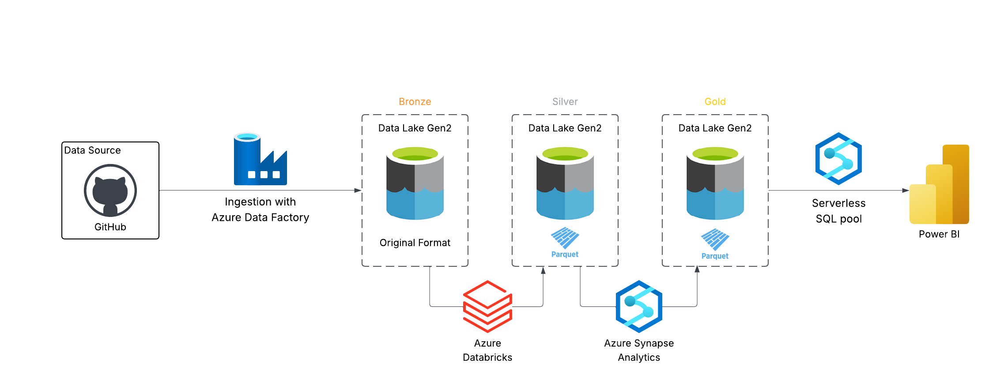

# Adventure-Works-Data-Engineering-Project
Adventure Works Data Engineering Pipeline using Azure Data Factory, Synapse Analytics, Azure Databricks and Power BI

## Introduction
The **Adventure Works Data Engineering Project** is an end-to-end data pipeline solution built using modern Azure tools. It ingests data from HTTP sources via **Azure Data Factory**, transforms it using **Azure Databricks**, and stores the processed data in **Azure Synapse Analytics**. The final datasets are visualized through **Power BI** dashboards, enabling insightful business reporting and analysis.

## Architecture

## Technology Used
1. Programming Language - Spark
2. Scripting Language - SQL
3. Azure
   -  Azure Data Factory
   -  Data Lake Storage Gen2
   -  Azure Synapse Analytics
4. Azure Databricks
5. PowerBI

## Dataset Used
The project uses **Adventure Works** sample data, a simulated dataset representing a fictitious manufacturing company. It includes data on sales, customers, products, and operations, making it ideal for demonstrating real-world data engineering and analytics workflows.

Here is the dataset used in the project - https://github.com/STMM-Hub/Adventure-Works-Data-Engineering-Project/tree/main/Data

Original Data Source - https://www.kaggle.com/datasets/ukveteran/adventure-works/data

